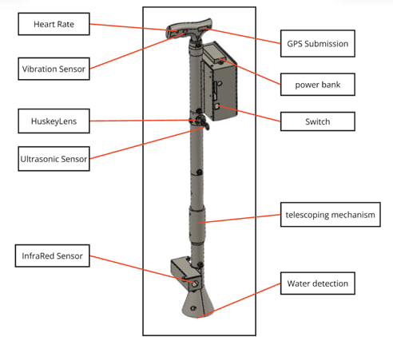

  

<h1 align="center">👁️‍🦯 Be-My-Eyes Smart Stick</h1>

  <b>AI-Powered Assistive Device for the Visually Impaired</b>  
   
  🚧 Obstacle Detection | 🤖 AI Vision | 📍 GPS Alerts | 🫀 Health Monitoring
    
  
  
  

---

## ✨ Features
- 🚧 **Obstacle Detection** – Ultrasonic + IR sensors detect barriers, stairs, and drops  
- 💧 **Water Detection** – Alerts user about wet/slippery surfaces  
- 🤖 **AI Vision (HuskyLens)** – Face recognition, object detection, line & color tracking  
- 🫀 **Health Monitoring** – Heart rate, body temperature, SpO₂, stress sensors  
- 📍 **GPS + GSM Alerts** – Sends real-time location & emergency SMS to caregivers  
- 🎤 **Smart Feedback** – Vibration motor + voice alerts for safe navigation  
- 📱 **Mobile App Integration** – Displays health data, location & emergency notifications  

---

## 🛠️ Hardware Used
- Arduino Mega 2560  
- Ultrasonic & Infrared sensors  
- HuskyLens AI Camera  
- GSM Module (SIM900A)  
- GPS Module (Neo-6M)  
- Water detection sensor  
- Vibration motor & buzzer  
- Mini MP3 Player Module (voice alerts)  
- Health Sensors (Heart rate, Temperature, SpO₂, GSR)  
- XL6009 Power Converter + Battery Pack  

---

## 💻 Software
- Arduino IDE  
- C/C++ Arduino sketches  
- HuskyLens & GSM libraries  
- Mobile App for monitoring  

---

## 📂 Repository Files

